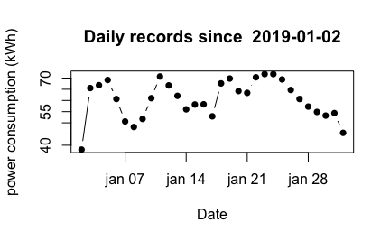

# rlinky

R package to fetch linky data from enedis website 

Bibliothèque en R pour récupérer les données de votre compteur linky à partir du site enedis

## Install - Installation

Use devtools package to install it from github 

Utilisez la bibliothèque devtools pour l'installer à partir de github

```r
devtools::install_github("achey2016/rlinky")
```

## Example - Exemple d'utilisation

```r
library(rlinky)
connect_enedis(secretfile = "~/.secret_enedis_json")
this_month_data <- query_daily_month(end_date = Sys.Date())
disconnect_enedis()
kWh <- this_month_data$graphe$data$valeur
day1 <- as.Date(this_month_data$graphe$periode$dateDebut, 
                format="\%d/\%m/\%Y")
Horodate <- seq(from = day1, length.out = length(kWh), by="day")
plot(Horodate, kWh, type="b", pch=16,
     main = paste("Daily records since ", day1),
     xlab = "Date", ylab = "power consumption (kWh)")
```




### Secretfile format - Format du fichier .secret_enedis_json

This file consists of four lines with your mail and password to connect to enedis website.
Make sure to keep it in a safe place, and use `Sys.chmod(".secret_enedis_json",mode="0400")` to make it unreadable for other users on your computer [see also httr tutorial on secrets](https://cran.r-project.org/web/packages/httr/vignettes/secrets.html). 

Ce fichier contient juste quelques lignes pour stocker son adresse mail et son mot de passe. Assurez-vous de le conserver dans un endroit sécurisé et de le rendre illisible pour les autres utilisateurs (par exemple avec `Sys.chmod(".secret_enedis_json",mode="0400")`) [cf. httr tutoriel sur les secrets](https://cran.r-project.org/web/packages/httr/vignettes/secrets.html)

```
{
  "IDToken1": ["mon.mail@pour.enedis"],
  "IDToken2": ["mon.mot.de.passe.pour.enedis"]
}
```
